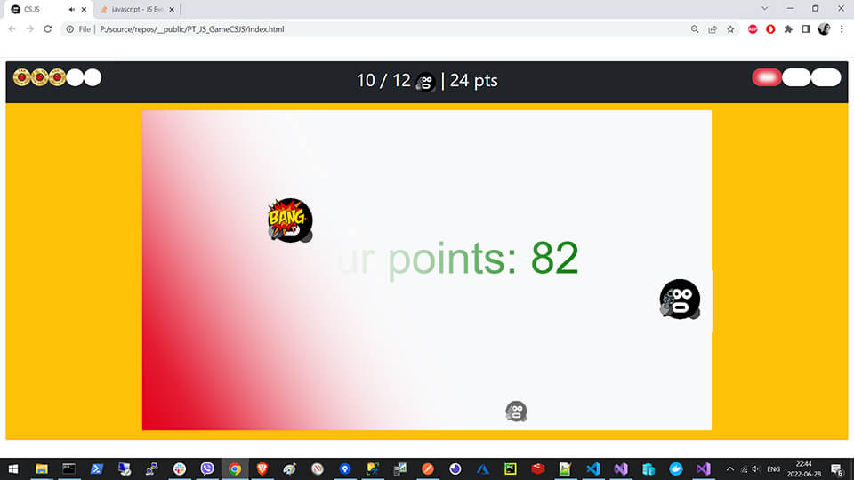

# PT_JS_GameCSJS

## General Information

CS.JS is a vanilla JS shooter game on a canvas. Shoot 'em all terrorists or lose!

These were one of the first lines I ever wrote with JavaScript. And here I am 2 years later, refactoring.
